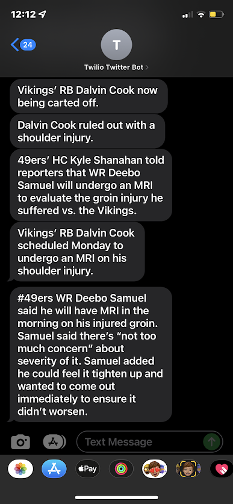

# Fantasy-Football-alerts

 https://img.shields.io/github/languages/top/farzinadil/Fantasy-Football-alerts?style=plastic

## About

This program streams tweets from Adam Shefter/Tom Pelissero (or other NFL reporters) and checks if the tweets contain news regarding any fantasy football players. If the program finds relavant news, it will send an SMS to the configured phone number using the Twilio API.

## Installation

### Requiremmts

1. Python 3.8
2. Twitter developer account
3. Twilio account (trial account is fine)

### Instructions

1. Clone repository
2. <code>cd Fantasy-Football-alerts</code>
3. <code>pip3 install -r requirements.txt</code>
4. Create a .env file and add Twitter API consumer key, consumer secret key, and bearer token as shown in .env.example
5. Add the Twilio account sid and Twilio auth token to the .env file as shown in the .env.example file
6. Add your phone number with +1 (ex: '+1800XXXXXXX') and your Twilio phone number in the same format as shown in .env.example
7. <code>python3 src/alerts.py</code>

## Examples

### SMS Alerts

